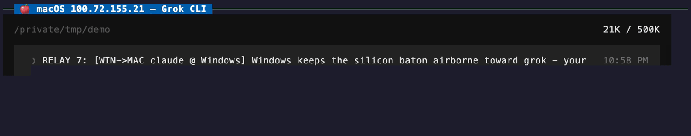
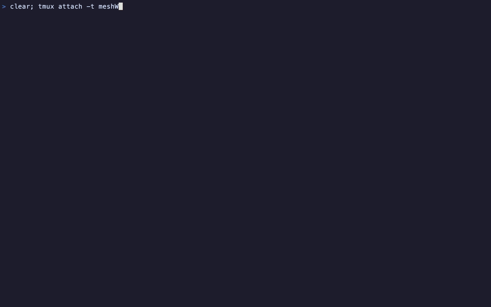
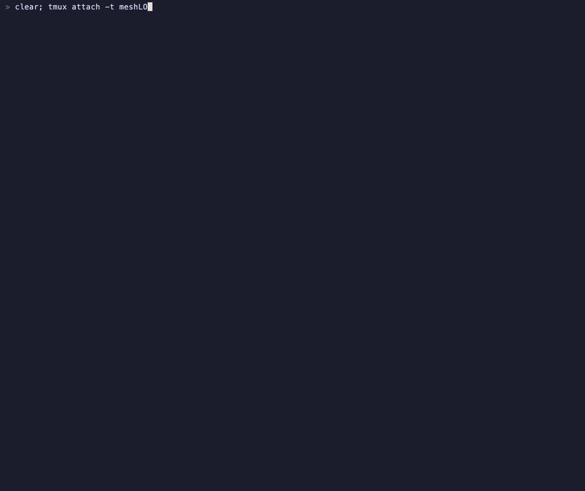

# telepty

**Connect any terminal to any terminal, any machine.**

telepty is a PTY orchestration daemon and session bridge for AI CLI workflows. It lets you spawn, attach to, and inject commands into terminal sessions — locally or across machines via Tailscale.

Built for AI CLI workflows (Claude Code, Codex, Gemini CLI), but works with any interactive terminal program.

Here is the one thing it exists for: a real Claude Code worker session (Opus 5), spawned by an orchestrator through telepty and viewed live via `telepty attach`. The orchestrator's prompts land in Claude's composer with no human at the keyboard — and Claude answers on camera:


## Install

```bash
# macOS / Linux
curl -fsSL https://raw.githubusercontent.com/dmsdc-ai/aigentry-telepty/main/install.sh | bash

# Windows (PowerShell as Admin) — BETA
iwr -useb https://raw.githubusercontent.com/dmsdc-ai/aigentry-telepty/main/install.ps1 | iex

# Or via npm
npm install -g @dmsdc-ai/aigentry-telepty
```

The installer sets up telepty as a background service (`launchd` on macOS, `systemd` on Linux, detached process on Windows).

**Windows is BETA.** It installs and the cross-machine demo below is a real Windows box, but
`windows-latest` CI is quarantined as non-blocking (Windows-specific failures tracked in #577),
the UDS delivery path is POSIX-only, and the inbound tailnet firewall rule only auto-installs
when the daemon runs elevated — otherwise you run one `netsh` command it prints for you.

## Quick Start

The installer already started the daemon, so `telepty list` answers immediately. (If it does
not, start one detached with `telepty daemon start`.)

```bash
# 1. Wrap an existing CLI session for remote control
telepty allow --id my-session claude

# 2. List active sessions (this daemon + registered peers)
telepty list

# 3. Inject a prompt into a session
telepty inject my-session "explain this codebase"

# 4. Attach to a session interactively
telepty attach my-session

# 5. Broadcast to all sessions
telepty broadcast "status report"
```

## Demo — three machines, three AI CLIs, one relay

Three LLM agents pass a baton around a Tailscale mesh **by running `telepty inject` themselves** — no SSH sessions, no copy-paste, no human typing after the kickoff:

```
🍎 macOS (Grok) ──▶ 🐧 Linux (Codex) ──▶ 🪟 Windows (Claude) ──▶ 🍎 macOS … (loop)
```

**How it works.** Each agent was given one rule (delivered via `telepty inject`, like everything else here): *"when a message containing `RELAY <n>:` arrives, reply, then run `telepty inject --submit <next-session>@<next-machine-ip> "RELAY <n+1>: …"` yourself."* The orchestrator sends a single `RELAY 1` kickoff — after that, every message you see crossing machines was sent by an LLM running the telepty CLI on its own.

Each capture below is the **same relay seen from a different machine**, recorded as a live `telepty attach` of that machine's original CLI TUI (telepty's cross-host attach renders the real interface, not a scraped transcript).

### 1️⃣ macOS — Grok CLI (`100.72.155.21`)

What to watch: the `RELAY 1` kickoff lands in Grok's message box → Grok answers → the footer shows `Relay hop … inject to demo-codex5` as Grok runs telepty against the Linux box. Later, `RELAY 4: [WIN->MAC …]` arrives **from Windows** and Grok fires the next lap:



### 2️⃣ Linux — Codex CLI (`100.70.64.60`)

The full story on one screen: Codex's welcome box (`/tmp/demo`, YOLO mode) → the relay rule arriving → `READY-X5` → `RELAY 2: [MAC->LINUX …]` landing from macOS → Codex's shell command:

```
Ran telepty inject --submit --from orchestrator demo-claude2@100.100.189.32 \
    "RELAY 3: [LINUX->WIN codex @ Linux] Linux catches cleanly; Windows, keep the loop flying!"
  ✅ Context injected successfully into 'demo-claude2'.
  ✅ Submitted via pty_cr — consumed as a new turn.
```

That is an LLM on Linux delivering a prompt **into another LLM's live session on a Windows machine** with one command:


### 3️⃣ Windows — Claude CLI (`100.100.189.32`)

Claude receives the `[LINUX->WIN]` baton in its composer, acknowledges, and closes the loop by injecting Grok back on macOS (`relay-grok3@100.72.155.21`) — completing macOS → Linux → Windows → macOS:



> **Notes** · The IPs are Tailscale CGNAT addresses (`100.64.0.0/10`) — private to the tailnet and unreachable from the public internet. · Message frames are held ~2.5s for readability; spinners run at natural speed. · The agents' quips are their own — nobody scripted "baton airborne".

### Bonus — same machine, session-to-session

Cross-machine is not required: the same `telepty inject` works between sessions on **one** box. Here three different AI CLIs on a single Mac — **Grok 4.5**, **Claude (Fable 5)**, and **Codex (gpt-5.5)** — relay a baton locally. Same command, no `@ip` suffix, zero window switching:

```
grok (relay-grok3) ──▶ claude (demo-claude-loc) ──▶ codex (demo-codex-loc2) ──▶ grok … (loop)
```

What to watch: `LOCAL 2: [grok -> claude, same box]` lands in Claude's composer the moment Grok runs its inject; each pane is a separate telepty session on the same machine:



This is the day-to-day shape of telepty: an orchestrator session driving worker sessions — dispatching prompts, reading screens, collecting reports — whether the workers live on the same machine or across a tailnet. The clip at the top of this README is that same shape seen from **inside the worker's own UI**.

## What telepty is — and what it is not

telepty is a **PTY orchestration daemon for AI CLI workflows**.
It is **not** a terminal multiplexer and does not replace tmux.

> **tmux is better at being a terminal. telepty is better at letting
> software operate many terminals.**

tmux owns terminal *fidelity*: panes, windows, full VT emulation, scrollback,
copy-mode, capture-pane, local Unix-socket operation, zero runtime deps.
telepty owns *automation*: HTTP/WS APIs, authenticated remote access,
readiness-aware inject/submit, event streams, cross-machine session control.

## telepty vs tmux

| Area | tmux | telepty |
|---|---|---|
| Core layer | terminal multiplexer + emulator | PTY orchestration daemon |
| Primary user | a human at a keyboard | software / an orchestrator |
| Terminal fidelity | full VT/grid/scrollback/copy-mode | output stream + heuristic state |
| IPC | local Unix socket | HTTP/WS/REST daemon (:3848) |
| Input model | open-loop `send-keys` | readiness-gated inject/submit |
| Multi-session fan-out | `synchronize-panes` (1 window, 1 host) | broadcast/multicast (cross-machine) |
| Remote | via SSH | native daemon HTTP, no sshd |
| Dependencies | zero runtime deps (C) | Node daemon + deps |

## When to use which
- **Use tmux** for panes, scrollback, copy-mode, capture-pane, and local
  human terminal work — telepty does none of this and doesn't try to.
- **Use telepty** when software needs to spawn, inspect, inject into, and
  track many AI-CLI sessions over an API — across machines.
- **vs agent frameworks** (LangGraph, CrewAI, …): they orchestrate model **API calls**;
  telepty orchestrates real **CLI processes** — the actual `claude`/`codex`/`gemini` binary
  with its own auth, tools, config, and TUI.
- **vs MCP**: MCP gives one agent tools; telepty gives one agent other agents' terminals.
  Complementary, and telepty ships its own MCP server (`telepty-mcp`, exposing
  `telepty_list_sessions` / `telepty_inject_session` / `telepty_session_status`) so an
  MCP-speaking agent can drive sessions without shelling out.
- **vs mosh / ssh**: those carry *your* keystrokes to *one* remote shell. telepty exposes
  *many* sessions to *software* over an API, and needs no sshd on either side.

## Limitations (honest)
- No terminal emulation: no cell grid, cursor model, or copy-mode. Screen
  reads are buffered bytes + heuristic state, not a ground-truth screen.
- `read-screen` therefore returns the **tail of the raw output stream with ANSI escapes
  stripped by regex**, not a rendered screen. A repainting TUI (spinners, redrawn boxes,
  progress lines) reads as several overlapping frames stacked on top of each other. Good
  for "what did it say", not for "what does the screen look like right now".
- **Session durability depends on who owns the PTY.** `allow`-wrapped sessions survive a
  daemon restart: the bridge process owns the PTY and re-registers on reconnect, and only
  `wrapped` sessions are rebuilt from the persisted session file. `spawn`ed sessions do
  **not** survive: their PTY is a child of the daemon process and dies with it — including
  the automatic daemon restart that `npm install -g` performs on upgrade. If a session must
  outlive the daemon, wrap it with `allow`.
- Requires a background daemon and a network port (:3848, auth-gated).

## Core Commands

| Command | Description |
|---------|-------------|
| `telepty daemon start\|stop\|restart` | Manage the background daemon (port 3848); `start` is detached and returns immediately |
| `telepty daemon` | Run the daemon in the **foreground** — this is what launchd/systemd invoke; it blocks your shell |
| `telepty allow --id <name> <cmd>` | Wrap a CLI for inject control (survives a daemon restart) |
| `telepty spawn --id <name> <cmd>` | Spawn a new background session (dies with the daemon) |
| `telepty list [--json]` | List sessions on this daemon + registered peers |
| `telepty attach [id[@host]]` | Attach to a session (interactive picker if no ID) |
| `telepty inject <id[@host]> "text"` | Inject text and submit it. The Enter rides along as a deferred PTY write and is **not** gated — there is no no-submit mode |
| `telepty inject --submit <id> "text"` | Same delivery, but the Enter becomes a separate **render-gated** submit: it waits until the target has actually rendered the text (retries once on safe gate-timeout) |
| `telepty inject --submit --submit-force <id> "text"` | As above, but bypass the gate (skip Layer 1/3 detection — opt-in escape hatch) |
| `telepty inject --submit --submit-retry N <id> "text"` | Override retry count [0–3] on safe 504 (default 1) |
| `telepty enter <id[@host]>` | Send Enter/Return to a session |
| `telepty multicast <id1,id2> "text"` | Inject into multiple sessions |
| `telepty broadcast "text"` | Inject into ALL sessions |
| `telepty rename <old> <new>` | Rename a session |
| `telepty read-screen <id> [--lines N]` | Read session screen buffer |
| `telepty connect-http <host>[:port]` | Register a remote daemon as a peer over HTTP (no SSH needed) |
| `telepty connect <user@host>` | Register a remote peer over SSH |
| `telepty peers` | List registered peers |
| `telepty disconnect <name>\|--all` | Remove a registered peer |
| `telepty reply "text"` | Reply to the last injector |
| `telepty monitor` | Real-time event billboard |
| `telepty listen` | Stream event bus as JSON |
| `telepty update` | Update to latest version |

## Environment variables

| Variable | Values | Default | Description |
|----------|--------|---------|-------------|
| `TELEPTY_SUBMIT_FORCE_DEFAULT` | `1`, `true`, `yes`, `on` to enable; unset, `0`, or `off` to disable | unset | Makes `telepty inject --submit <id> "text"` behave as if `--submit-force` was passed. |
| `TELEPTY_MODAL_REMEDY` | `park`, `hold`, `reject`, `off` | `park` for claude, `hold` for codex | What to do when the target CLI is showing a blocking modal, where an Enter activates the modal's highlighted item instead of submitting. `park` acks immediately and queues the inject, delivering it in order once the surface clears; `hold` keeps the request open until the surface clears, then delivers; `reject` refuses immediately with an actionable error; `off` restores pre-0.6.18 behavior (writes into the modal). Setting it overrides the per-CLI default for every session. |
| `TELEPTY_MODAL_HOLD_MS` | milliseconds | `30000` | How long `TELEPTY_MODAL_REMEDY=hold` waits for the modal to clear before falling back to `reject`. |
| `TELEPTY_MODAL_PARK_TTL_MS` | milliseconds | `600000` | How long `TELEPTY_MODAL_REMEDY=park` holds queued injects for a modal that never clears, before flushing them with an actionable `modal_park_timeout` event. Matches `TELEPTY_BRIDGE_INJECT_TTL_SECS`. |
| `TELEPTY_SHARED_REF_TTL_DAYS` | days (`0` disables the sweep) | `7` | Age at which `~/.telepty/shared/*.md` payloads from `inject --ref` are deleted. The sweep runs at the start of each `--ref` write, not on a timer. |

`TELEPTY_SUBMIT_FORCE_DEFAULT=1` is for orchestrators and automation that
already know their targets are real, initialized REPLs. It avoids the transient
504 `bootstrap_not_ready` path where injected text lands in the target input box
but the render-gated submit refuses to press Enter while the target session is in
a temporary working state.

This bypasses the safety gate that protects sessions still booting. Set it only
when you understand that trade-off. Use `--no-submit-force` on a specific
`telepty inject --submit` call to restore the gated behavior even when the
environment default is enabled.

`TELEPTY_MODAL_REMEDY` exists because a modal is not just "not ready" — it can be
destructive. A fresh codex whose `version.json` has `dismissed_version` <
`latest_version` opens an update modal whose PRE-SELECTED item is
`1. Update now (runs \`brew upgrade --cask codex\`)`; telepty's bracketed-paste body
moves no selection, so the submit CR activates that default and codex runs the
upgrade and exits. Claude Code has the same hazard with a longer fuse: an
`ExitPlanMode` approval highlights `1. Yes, auto-accept edits`, and an
`AskUserQuestion` list splices injected text into the answer the human is typing.
Nothing is written into a modal unless you set `off`.

The default differs per CLI because the modals have different lifetimes. codex's
is machine-owned and transient, so `hold` (keep the request open for up to
`TELEPTY_MODAL_HOLD_MS`) clears it or nothing will. Claude's waits on a **human**
and routinely stays up for minutes — longer than the HTTP client's own timeout —
so claude defaults to `park`: the inject is acknowledged immediately, queued, and
delivered in order once the surface clears. A parked inject reports
`strategy: bootstrap_queue`, `parked: surface_modal`, and its queue depth.

## Cross-Machine Sessions

Two different things are at play here, and only one of them is zero-config:

- **Reachability is zero-config on a tailnet.** The daemon binds and trusts tailnet peers by
  itself (below), and `<id>@<host>` targeting works right away against any reachable daemon —
  no registration step. `inject`, `attach`, `read-screen`, `enter`, `multicast` and `rename`
  all accept `@<host>`.
- **Discovery is not.** `telepty list` enumerates this daemon's sessions plus the peers
  recorded in `~/.telepty/peers.json` — it does **not** scan the tailnet. Two fresh tailnet
  machines each see only their own sessions until you register one with the other:

  ```bash
  telepty connect-http <host>        # HTTP only — no sshd on either side
  telepty connect <user@host>        # over SSH (ControlMaster)
  telepty peers                      # what is registered
  telepty disconnect <name>           # unregister
  ```

  After that, `list` / `broadcast` / `multicast` see the peer's sessions too.

### Zero-config on Tailscale (auto bind + auto trust)

On a host that is on a **Tailscale tailnet**, a fresh install is cross-machine-*reachable* with
**no manual env**. At startup the daemon detects its tailnet interface (a `100.64.0.0/10`
address) and:

- **binds :3848 to the tailnet IP only** (plus loopback) — LAN/public interfaces stay
  closed, so the control API is reachable **only from your Tailnet**, never the flat LAN;
- **trusts tailnet peers automatically** — Tailscale's own ACLs already gate who is on the
  tailnet, so a tailnet peer needs no token or manual allowlist.

> **Trust boundary:** on a Tailscale host, telepty auto-exposes :3848 to your **entire
> tailnet** (every peer Tailscale's ACLs let onto it). If you share your tailnet with
> machines you don't fully trust, set `TELEPTY_PEER_ALLOWLIST` to restrict to specific
> peers/CIDRs, or `TELEPTY_NO_TAILNET_AUTO=1` to stay loopback-only.

**Zero-config cross-machine is Tailscale-specific.** On a non-Tailscale host (plain LAN,
other mesh VPNs) the daemon stays **loopback-only** (the safe default) — set `TELEPTY_BIND`
+ `TELEPTY_PEER_ALLOWLIST` manually to expose it. Manual `TELEPTY_BIND` / `HOST` /
`TELEPTY_PEER_ALLOWLIST` always win over auto-detect.

**Windows:** Defender Firewall blocks inbound on the tailnet interface by default. On the
auto path the daemon adds the inbound allow-rule automatically when run elevated, otherwise
it prints the exact one-time `netsh` command in the startup banner.

Addressing stays **IP-free**: use MagicDNS / hostnames with `<id>@<host>` (below) — you
never need to type a `100.x.y.z` address.

### `<id>@<host>` syntax

To target a specific host — the same session ID existing on several hosts, or a host you
have not registered as a peer — append `@<host>` to the session ID. `<host>` can be a
hostname, LAN IP, or Tailnet name. This needs no `connect`/`connect-http` first: the target
is resolved directly, which is why the relay demo above works between fresh machines.

```bash
# Hostname / Tailnet name
telepty inject my-session@macbook "hello"
telepty attach worker@server-01

# LAN IP — useful when no Tailnet is configured
telepty inject orchestrator-claude@172.28.4.165 "ping"
telepty read-screen build-runner@10.0.0.42 --lines 50
```

**Requirements**:
- The remote daemon must be reachable on port **3848** from the calling host
  (LAN routing, firewall rules, or Tailscale).
- No SSH or `sshd` is required on either side — the call hits the remote
  daemon's HTTP API directly. This is the recommended path for laptop
  daemons that don't run sshd.
- The `@<host>` qualifier works for `inject`, `attach`, `read-screen`,
  `enter`, `multicast`, and `rename`.

## How It Works

```
CLI (telepty) ──> HTTP/WS ──> Daemon (:3848)
                                 ├── Session WebSocket (/api/sessions/:id)
                                 ├── Event Bus WebSocket (/api/bus)
                                 └── REST API (/api/sessions/*)
```

- **`allow`** wraps a CLI process in a PTY bridge, enabling remote inject
- **`inject`** delivers text over the transport that session type owns: owner WebSocket, a direct PTY write, or UDS (Unix Domain Socket for embedded integrations)
- **`submit`** is handled separately from text injection for reliability across all AI CLIs

## `[context-ref]` Protocol — long payloads via shared file

When a sender uses `telepty inject --ref <file> <target> "<message>"`, telepty
stores the payload in a shared file under `~/.telepty/shared/<sha256>.md` and
injects only a short pointer prompt of the form:

```
[context-ref] Read ~/.telepty/shared/<sha256>.md and use it as the source of truth for this task.
<inline message>
```

This avoids prompt rot in the receiving session (and in the orchestrator's
window when the reply is small).

### Receiver contract

The receiving AI session is expected to:
1. Detect the `[context-ref]` prefix on the first line.
2. Read the file at the absolute path.
3. Treat the file contents as the **authoritative payload** for the task — the
   inline message is supplementary (topic / hint), not the source of truth.

### Storage location

- File path: `~/.telepty/shared/<sha256>.md` (sha256 of payload body)
- Created with mode `0600`; readable only by the local user
- Swept on write, not on a timer: every `--ref` inject first deletes shared files older than
  `TELEPTY_SHARED_REF_TTL_DAYS` (default `7`). Nothing runs while you are idle, so a directory
  you stop using keeps its last files until the next `--ref` — `rm ~/.telepty/shared/*.md` to
  clear it now. There is no `telepty clean --shared` subcommand.

### When to use `--ref`

- Payload exceeds ~1KB or contains structured content (code, logs, tables).
- You want the receiver to load the payload deterministically rather than
  paraphrase it from the inject prompt.
- You're orchestrating a multi-hop conversation where the orchestrator should
  not see the full payload in its own context window.

### Integration scope

Per-agent receiver integrations (auto-loading the file via Claude Code
`UserPromptSubmit` hooks, Codex `AGENTS.md` directives, etc.) are **out of
scope for telepty core** — they live in the agent's own configuration.
Per-CLI hook installation lives in devkit: run `aigentry scaffold
install-hooks {claude|codex|gemini}` after installing
`@dmsdc-ai/aigentry-devkit`. (Older drafts proposed a receiver-side
`telepty install` subcommand for this; that direction is rejected per ADR
2026-05-05-telepty-devkit-boundary §3.1.2 / §3.4 row 2.)

## Inject Delivery Paths

Delivery is picked by **session type**, not by a priority ladder — there is no fallback chain
between these rows.

| Session type | Created by | Delivery |
|---|---|---|
| `aterm` | embedded IPC integration | UDS (Unix Domain Socket); an HTTP delivery endpoint for back-compat |
| `wrapped` | `telepty allow` | owner WebSocket → the bridge writes the PTY it owns |
| `spawned` | `telepty spawn` | direct write into the daemon-owned PTY |

The submit (Enter) is separate from all of this and is always a bare `0x0D` into the innermost
PTY. The old `kitty @ send-text` and `cmux send-key` submit paths were removed (#544/#546) —
they were a flaky side channel next to a reliable PTY write.

## AI CLI Integration

telepty works as a session bridge for AI CLIs. Use `allow` to wrap any CLI:

```bash
# Claude Code
telepty allow --id claude-main claude

# Codex
telepty allow --id codex-main codex

# Gemini CLI
telepty allow --id gemini-main gemini
```

Then inject prompts, read output, or attach from anywhere:

```bash
telepty inject claude-main "refactor the auth module"
telepty read-screen claude-main --lines 50
telepty attach claude-main
```

## Deliberation (Multi-Session Discussion)

Coordinate structured discussions across multiple AI sessions:

```bash
telepty deliberate --topic "API design for v2" --sessions claude-1,claude-2,codex-1
telepty deliberate status
telepty deliberate end <thread_id>
```

## Skill Installation

telepty ships with packaged skills for Claude Code, Codex, and Gemini CLI. Run the interactive installer:

```bash
telepty
# Choose "Install telepty skills"
```

## Testing

```bash
npm test              # 70 tests (node:test)
npm run test:watch    # Watch mode
```

## Ecosystem

telepty runs **standalone** — it needs none of the other aigentry modules and installs with the single command above. It is also the transport layer of the broader **aigentry** ecosystem, whose modules are each independently published and independently useful:

| Module | Package | Version | Role | Maturity |
| --- | --- | --- | --- | --- |
| **telepty** | `@dmsdc-ai/aigentry-telepty` | 0.7.0 | Cross-terminal / cross-machine prompt transport (PTY daemon) | Shipping |
| **brain** | `@dmsdc-ai/aigentry-brain` | 0.3.1 | Persistent cross-session memory (MCP server) | Early |
| **deliberation** | `@dmsdc-ai/aigentry-deliberation` | 0.0.47 | Multi-AI structured debate + synthesis (MCP server) | Early |
| **devkit** | `@dmsdc-ai/aigentry-devkit` | 0.1.14 | Installer/scaffold for the AI dev environment | Early |
| **aterm** | `@dmsdc-ai/aterm` | 0.2.14 | Terminal launcher with native session IPC | Early |
| **orchestrator** | *(unpublished)* | — | Control tower that drives sessions via telepty | Internal |

> Licenses: all MIT except `@dmsdc-ai/aterm` (UNLICENSED).

## License

MIT
